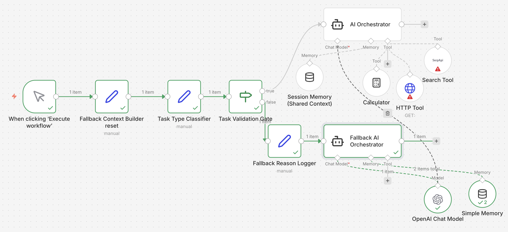

## 🧩 Architecture Diagram

The following diagram illustrates the agentic AI orchestration flow implemented in n8n.

## 🔍 Diagram Walkthrough

1. **Trigger**
   - Manual trigger simulates incoming user requests.

2. **Fallback Context Builder**
   - Prepares a minimal, safe context for unsupported or invalid tasks.

3. **Task Type Classifier**
   - Classifies user intent (e.g., calculation, search, reasoning).

4. **Task Validation Gate**
   - Deterministic control logic:
     - `TRUE` → Primary AI Orchestrator
     - `FALSE` → Fallback AI Orchestrator

5. **Primary AI Orchestrator**
   - Uses OpenAI Chat Model
   - Has access to:
     - Calculator tool
     - HTTP / Search tools
     - Shared session memory

6. **Fallback AI Orchestrator**
   - Gracefully handles:
     - Invalid tasks
     - Unsupported intents
     - 🧠 Independent Simple Memory
     - Fully isolated from the primary agent’s memory.

7. **Primary Session Memory**

     - Maintains conversational context only for the primary agent.

     - Not shared with fallback execution paths.

     - Ensures controlled and predictable state management.

7. **Simple Memory**
  
    - Stores only fallback-related interactions.

    - Prevents memory leakage between execution paths.

    - Reinforces safety and separation of concerns.
    - 

🧠 **Key Architectural Principles Demonstrated**

- Deterministic routing before AI invocation

- Explicit validation and safety gates

- Tool-augmented reasoning for valid tasks

- Isolated memory per agent (no shared state)

- Graceful degradation instead of failure

- Production-style agent orchestration patterns

👤 Author

Bashirul Shikder
Data Analyst | AI & Agentic Systems
🔗 GitHub: https://github.com/bshikder

🔗 LinkedIn: https://linkedin.com/in/bashirulshikder

⭐ Acknowledgment

Built to explore agentic AI patterns beyond prompt engineering, focusing on control, safety, and orchestration.
